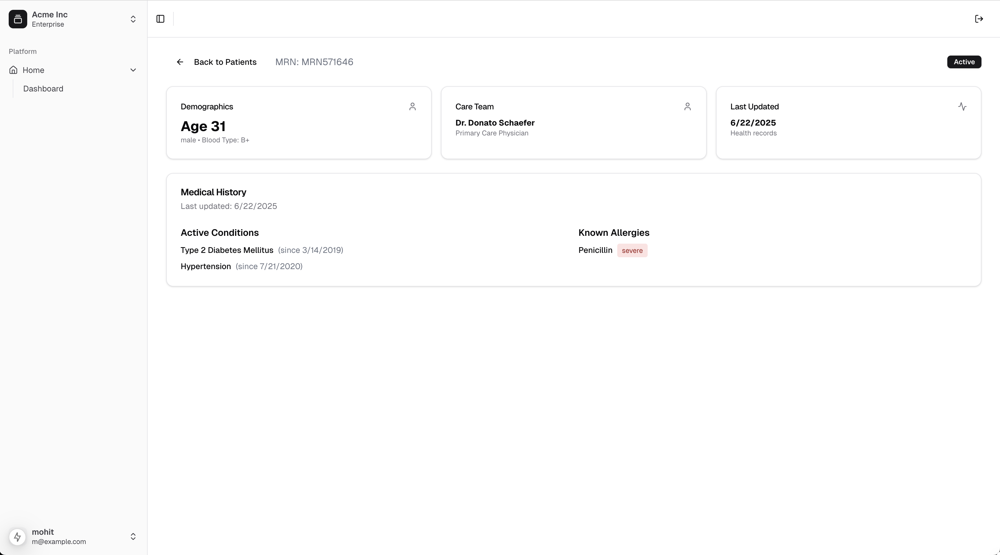

# Assemble Coding Exercise

A healthcare patient dashboard built with Next.js and NestJS. Providers can browse patients and inspect clinical data backed by FHIR R4.

## Tech Stack

- **Frontend**: Next.js 15, TypeScript, Tailwind CSS, shadcn/ui
- **Backend**: NestJS, TypeScript, PostgreSQL
- **Healthcare**: FHIR R4 via a local HAPI FHIR server
- **Monorepo**: Turborepo + pnpm workspaces
- **Auth**: JWT with NextAuth.js

## Quick Start

### Prerequisites

- Node.js 20+
- pnpm 10 (`corepack enable` is enough if you do not have it)
- Docker Compose

### 1. Install dependencies

```bash
pnpm install
```

### 2. Start infrastructure

```bash
docker compose up -d
```

This starts:

- PostgreSQL on port 5432
- HAPI FHIR on port 3002 (web UI at http://localhost:3002)

The FHIR server usually needs 30–60 seconds before it will accept traffic. Wait until http://localhost:3002/fhir/metadata responds before seeding.

### 3. Start the apps

```bash
pnpm run dev
```

This starts the Next.js app and the Nest API. On first boot the API creates the local Postgres tables.

| App | URL |
| --- | --- |
| Patient dashboard | http://localhost:3000 |
| Backend API | http://localhost:4000 |
| API docs (Swagger) | http://localhost:4000/api |
| FHIR API | http://localhost:3002/fhir |
| FHIR web UI | http://localhost:3002 |

There are no default users. Sign up at http://localhost:3000/register, then log in.

### 4. Seed sample data

```bash
pnpm seed
```

This creates sample patients in PostgreSQL and matching clinical data on the FHIR server. After it finishes, open the dashboard, click a patient, and use http://localhost:3002 if you want to inspect FHIR resources.

## The exercise

Spend **no more than one hour**. It is fine if you do not finish. We care more about thought process and code quality.

The patient detail page is unfinished. Build the overview so it matches this design:



Explore the repo, the API, and the FHIR server to decide how to get there. There is more than one reasonable path.

When you are done:

1. Work on a new git branch and use [conventional commits](https://www.conventionalcommits.org/en/v1.0.0/).
2. Push the branch and open a pull request against `main`.
3. Tell us when it is ready for review.
4. If you used AI tools (ChatGPT, Claude, Cursor, Copilot, etc.), add `AI_USAGE.md` at the repo root with the tool(s), how you used them, key prompts, and the model if you chose one.

Questions are welcome.
